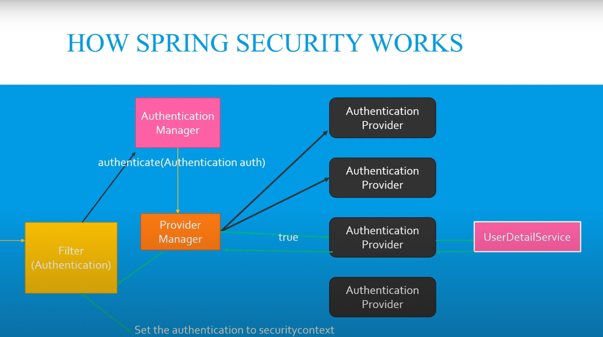

# Spring Security 2.0

    This project handle different ways of integrating spring security.



## Not Recommended Ways of spring security 

    Go through each caseXX.md file mentioned in config package

````
Case 1 : No WebSecurity Configuration Available
````

````
Case 2 : WebSecurity Configuration With Default User
````

````
Case 3 : WebSecurity Configuration With InMemory Users & No Password Encoder
````

````
Case 4 : WebSecurity Configuration With InMemory Users & Password Encoder
````

````
Case 5 : WebSecurity Configuration With InMemory Users & Password Encoder & antmatchers
````