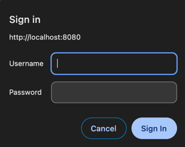

## Case 2 : WebSecurity Configuration With Default User
        Basic Authentication :: Log out not possible

```
@Configuration
@EnableWebSecurity
public class WebSecurityConfig extends WebSecurityConfigurerAdapter {
    
    
    @Override
    protected void configure(HttpSecurity http) throws Exception {
        http
                .authorizeRequests()
                .anyRequest()
                .authenticated()
                .and()
                .httpBasic();
    }
}
```


### In case of form based authentication

Form Authentication :: Log out possible

```
@Configuration
@EnableWebSecurity
public class WebSecurityConfig extends WebSecurityConfigurerAdapter {
    
    
    @Override
    protected void configure(HttpSecurity http) throws Exception {
        http
                .authorizeRequests()
                .anyRequest()
                .authenticated()
                .and()
                .formLogin();
    }
}
```

